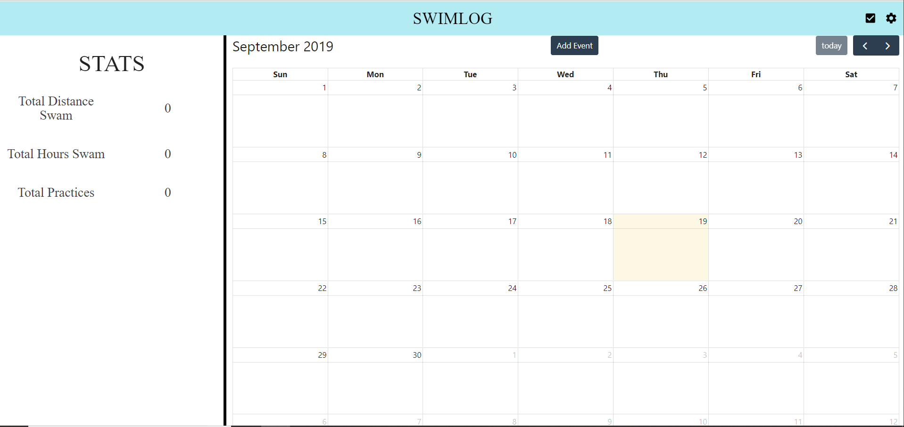

# SwimLog
Uses the MERN stack and FullCalendar to implement a swim practice journal with an interactive calendar UI. 

Also uses JWT and passport middleware to implement login and authentication functionality (following Rishi Prasad's guide @https://blog.bitsrc.io/build-a-login-auth-app-with-mern-stack-part-1-c405048e3669)

